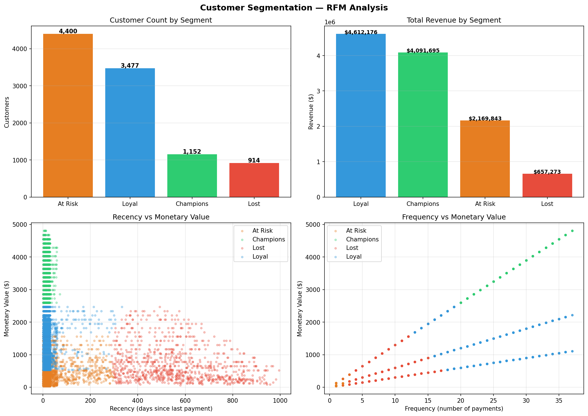

# Customer Segmentation — RFM Analysis

> Segmented 9,943 SaaS customers into 4 actionable groups using RFM scoring and K-means clustering — revealing that 1,152 Champions generate 35.5% of total revenue while 4,400 At-Risk customers represent the single largest retention opportunity. Cluster count validated via elbow method and silhouette score. LTV estimated per segment to prioritize retention spend.


---

## Segments



---

## Key Findings

- **Champions (1,152 customers)** — highest frequency (27 payments avg), highest spend ($3,552 avg), most recent activity (16 days avg) — generate $4.09M or 35.5% of total revenue
- **Loyal (3,477 customers)** — active and frequent (24 payments avg) but lower spend ($1,326 avg) — contribute $4.61M or 40.0% of revenue, the largest revenue block
- **At Risk (4,400 customers)** — low frequency (8 payments avg) and low spend ($493 avg) — largest segment by headcount, generating only $2.17M or 18.8% of revenue
- **Lost (914 customers)** — last payment 563 days ago on average — contributing $657K that is unlikely to recur without a win-back campaign

**Total revenue across 9,943 customers: $11.53M**

---

## Business Recommendations

| Segment | Customers | Revenue | Action |
|---|---|---|---|
| Champions | 1,152 | $4.09M | Upsell to Enterprise plan — highest LTV potential |
| Loyal | 3,477 | $4.61M | Offer annual contracts — lock in recurring revenue |
| At Risk | 4,400 | $2.17M | Trigger re-engagement campaign — largest churn risk |
| Lost | 914 | $657K | Win-back email sequence — low cost, high upside |

---

## Methodology

**RFM Scoring:**
- **Recency** — days since last successful payment
- **Frequency** — total number of successful payments
- **Monetary** — total amount paid

**Clustering:**
- Features standardized using StandardScaler before clustering
- K-means with k=4 — validated using both elbow method (inertia) and silhouette score across k=2 to k=8 (see `reports/cluster_validation.png`)
- Segment labels derived from cluster centroid rankings — no hardcoded thresholds

**LTV Estimation:**
- Average monthly spend per customer computed from payment history
- Active months estimated from recency relative to dataset window
- Estimated LTV = avg monthly spend × active months, aggregated per segment
- Output: `reports/ltv_by_segment.csv`

**Data:**
- 9,943 customers with at least one successful payment
- Snapshot date: one day after most recent payment in dataset
- Failed payments excluded from RFM calculation

---

## Cluster Profiles

| Segment | Customers | Avg Recency | Avg Frequency | Avg Spend | Total Revenue | Revenue % |
|---|---|---|---|---|---|---|
| Champions | 1,152 | 16 days | 27 payments | $3,552 | $4,091,695 | 35.5% |
| Loyal | 3,477 | 21 days | 24 payments | $1,326 | $4,612,176 | 40.0% |
| At Risk | 4,400 | 30 days | 8 payments | $493 | $2,169,843 | 18.8% |
| Lost | 914 | 563 days | 10 payments | $719 | $657,273 | 5.7% |

---

## Project Structure
```
customer_segmentation/
│
├── src/
│   └── rfm_analysis.py         # RFM scoring, K-means, validation, LTV estimation
├── data/
│   ├── customers.csv           # 10,000 customers
│   ├── payments.csv            # 300K+ payment records
│   └── subscriptions.csv       # 10,000 subscriptions
├── reports/
│   ├── rfm_segments.png        # Segment count, revenue, LTV, scatter plots, heatmap
│   ├── cluster_validation.png  # Elbow + silhouette score charts
│   ├── rfm_scores.csv          # Per-customer RFM scores and segment labels
│   └── ltv_by_segment.csv      # Estimated LTV per segment
└── README.md
```

---

## Run Locally
```bash
pip install pandas numpy scikit-learn matplotlib
python src/rfm_analysis.py
```

---

## Tech Stack

| Layer | Tools |
|---|---|
| RFM Scoring | Pandas, NumPy |
| Clustering | scikit-learn (K-means, StandardScaler) |
| Visualization | Matplotlib |
| Language | Python 3.9+ |